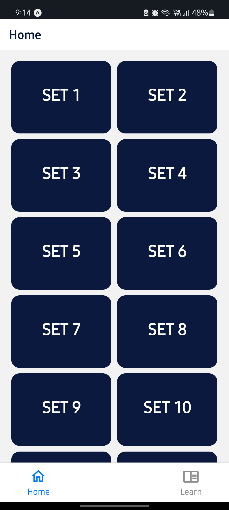
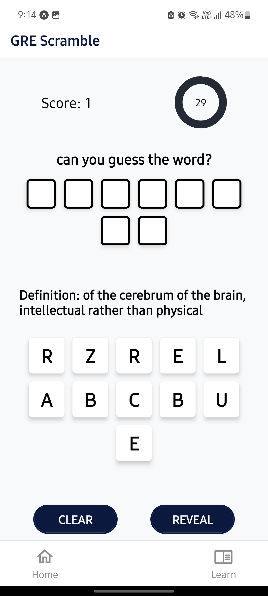
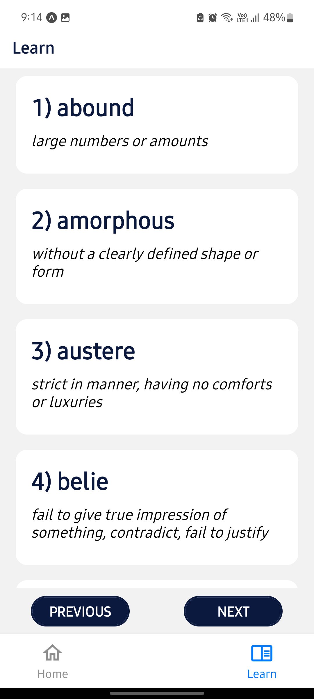

# **GRE SCRAMBLE**
### A React Native application to help build and test your GRE vocabulary skills.

    
## Demo

### **1. Home Screen**

    - shows the list of all available sets to test your vocab skills on

  

### **2. Scramble Screen**

    - prompts a random word from the selected set

  

### **3. Learn Screen**

    - displays the words and their meanings for all 27 sets

  

